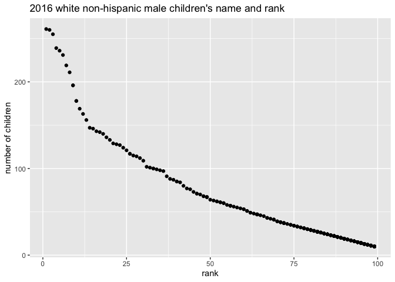

p8105\_hw2\_yl4925
================
Yiming Li
10/3/2021

## Problem 1

Load trash wheel as required

``` r
trash_wheel_df = readxl::read_excel(
  "./data/Trash-Wheel-Collection-Totals-7-2020-2.xlsx",
  sheet = "Mr. Trash Wheel",
  range = "A2:N535") %>% 
  janitor::clean_names() %>% 
  drop_na(dumpster) %>% 
  filter(dumpster != "Grand Total") %>% 
  mutate(sports_balls = round(sports_balls))
trashrow = nrow(trash_wheel_df)
trashcol = ncol(trash_wheel_df)

trash_wheel_df
```

    ## # A tibble: 453 × 14
    ##    dumpster month  year date                weight_tons volume_cubic_yards
    ##    <chr>    <chr> <dbl> <dttm>                    <dbl>              <dbl>
    ##  1 1        May    2014 2014-05-16 00:00:00        4.31                 18
    ##  2 2        May    2014 2014-05-16 00:00:00        2.74                 13
    ##  3 3        May    2014 2014-05-16 00:00:00        3.45                 15
    ##  4 4        May    2014 2014-05-17 00:00:00        3.1                  15
    ##  5 5        May    2014 2014-05-17 00:00:00        4.06                 18
    ##  6 6        May    2014 2014-05-20 00:00:00        2.71                 13
    ##  7 7        May    2014 2014-05-21 00:00:00        1.91                  8
    ##  8 8        May    2014 2014-05-28 00:00:00        3.7                  16
    ##  9 9        June   2014 2014-06-05 00:00:00        2.52                 14
    ## 10 10       June   2014 2014-06-11 00:00:00        3.76                 18
    ## # … with 443 more rows, and 8 more variables: plastic_bottles <dbl>,
    ## #   polystyrene <dbl>, cigarette_butts <dbl>, glass_bottles <dbl>,
    ## #   grocery_bags <dbl>, chip_bags <dbl>, sports_balls <dbl>,
    ## #   homes_powered <chr>

Read and clean precipitation data for 2018 and 2019. For each, omit rows
without precipitation data and add a variable for year. Next, combine
precipitation dataset and convert month to a character variable

``` r
pre2019 = readxl::read_excel(
  "./data/Trash-Wheel-Collection-Totals-7-2020-2.xlsx",
  sheet = "2019 Precipitation",
  range = "A2:B14"
) %>% 
  janitor::clean_names() %>% 
  drop_na(total) %>% 
  mutate(year = 2019) %>% 
  relocate(year)

pre2018 = readxl::read_excel(
  "./data/Trash-Wheel-Collection-Totals-7-2020-2.xlsx",
  sheet = "2018 Precipitation",
  range = "A2:B14"
) %>% 
  janitor::clean_names() %>% 
  drop_na(total) %>% 
  mutate(year = 2018) %>% 
  relocate(year)
pre2019row = nrow(pre2019)
pre2019col = ncol(pre2019)
pre2018row = nrow(pre2018)
pre2018col = ncol(pre2018)
```

``` r
##month.name is a vector, not function
combo = bind_rows(pre2018, pre2019) %>% 
  mutate(month = month.name[month])
combo
```

    ## # A tibble: 24 × 3
    ##     year month     total
    ##    <dbl> <chr>     <dbl>
    ##  1  2018 January    0.94
    ##  2  2018 February   4.8 
    ##  3  2018 March      2.69
    ##  4  2018 April      4.69
    ##  5  2018 May        9.27
    ##  6  2018 June       4.77
    ##  7  2018 July      10.2 
    ##  8  2018 August     6.45
    ##  9  2018 September 10.5 
    ## 10  2018 October    2.12
    ## # … with 14 more rows

``` r
sum_2018 = sum(pull(pre2018, total))
ball_2019 = filter(trash_wheel_df, year == 2019)
median_2019 = median(pull(ball_2019, sports_balls))
```

Trash Wheel size is (453, 14). When we load Trash Wheel data, we find
that it includes dumpster labels, date variable(month, year, date) and
totally 10 different categories of trash(Weight\_tons,
volume\_cubic\_yards, plastic\_bottles, polystyrene, cigarette\_butts,
glass\_bottles, grocery\_bags, chip\_bags, sports\_bags,
homes\_powered). Weight\_tons ranges from 0.78 to 5.62 with mean
3.2002208, volume\_cubic\_yards ranges from 7 to 20 with mean
15.4128035, plastic\_bottles ranges from 210 to 5960 with mean
1898.9293598, polystyrene ranges from 210 to 6540 with mean
1920.9205298. (other types of trash are omitted)

The size for 2018 precipitation and 2019 precipitation both are (12, 3).
The total precipitation in 2018 is 70.33, the median number of sports
balls in a dumpster in 2019 is 9.

## Problem 2

Load pols\_month as required, add president variable to show party of
president.

``` r
pols_month = read_csv("./data/fivethirtyeight_datasets/pols-month.csv") %>% 
  janitor::clean_names() %>% 
  separate(mon, into = c("year", "month", "day"), sep = "-") %>% 
  mutate(month = month.name[as.integer(month)],
         president = if_else(prez_gop == 1, "republic", "democratic")) %>% 
  select(-day, -prez_gop, -prez_dem)

pols_month
```

    ## # A tibble: 822 × 9
    ##    year  month     gov_gop sen_gop rep_gop gov_dem sen_dem rep_dem president 
    ##    <chr> <chr>       <dbl>   <dbl>   <dbl>   <dbl>   <dbl>   <dbl> <chr>     
    ##  1 1947  January        23      51     253      23      45     198 democratic
    ##  2 1947  February       23      51     253      23      45     198 democratic
    ##  3 1947  March          23      51     253      23      45     198 democratic
    ##  4 1947  April          23      51     253      23      45     198 democratic
    ##  5 1947  May            23      51     253      23      45     198 democratic
    ##  6 1947  June           23      51     253      23      45     198 democratic
    ##  7 1947  July           23      51     253      23      45     198 democratic
    ##  8 1947  August         23      51     253      23      45     198 democratic
    ##  9 1947  September      23      51     253      23      45     198 democratic
    ## 10 1947  October        23      51     253      23      45     198 democratic
    ## # … with 812 more rows

Load snp data and rearrange data through 2-digit year

``` r
snp_raw = read_csv("./data/fivethirtyeight_datasets/snp.csv") %>% 
  janitor::clean_names() %>% 
  separate(date, into = c("month", "day", "year"), sep = "/") %>% 
  relocate(year, month) %>% 
  mutate(month = as.integer(month)) %>% 
  arrange(year, month) %>% 
  mutate(month = month.name[month]) %>%
  select(-"day")

snp_after_2000 = filter(snp_raw, year <= 20) %>% 
  mutate(year = as.character(as.numeric(year) + 2000))
snp_before_2000 = filter(snp_raw, year >= 20) %>% 
  mutate(year = as.character(as.numeric(year) + 1900))
snp = bind_rows(snp_before_2000, snp_after_2000) 

snp
```

    ## # A tibble: 787 × 3
    ##    year  month     close
    ##    <chr> <chr>     <dbl>
    ##  1 1950  January    17.0
    ##  2 1950  February   17.2
    ##  3 1950  March      17.3
    ##  4 1950  April      18.0
    ##  5 1950  May        18.8
    ##  6 1950  June       17.7
    ##  7 1950  July       17.8
    ##  8 1950  August     18.4
    ##  9 1950  September  19.5
    ## 10 1950  October    19.5
    ## # … with 777 more rows

Load unemployment data and switch it to longer version.

``` r
unemployment = read_csv("./data/fivethirtyeight_datasets/unemployment.csv") %>% 
  pivot_longer(
    Jan:Dec, 
    names_to = "month",
    values_to = "unemployment"
  ) %>% 
  mutate(month = month.name[match(month,month.abb)]) %>% 
  rename(year = Year) %>% 
  mutate(year = as.character(year))

unemployment
```

    ## # A tibble: 816 × 3
    ##    year  month     unemployment
    ##    <chr> <chr>            <dbl>
    ##  1 1948  January            3.4
    ##  2 1948  February           3.8
    ##  3 1948  March              4  
    ##  4 1948  April              3.9
    ##  5 1948  May                3.5
    ##  6 1948  June               3.6
    ##  7 1948  July               3.6
    ##  8 1948  August             3.9
    ##  9 1948  September          3.8
    ## 10 1948  October            3.7
    ## # … with 806 more rows

Join the datasets by merging snp into pols, and merging unemployment
into the result.

``` r
pols_snp = left_join(pols_month, snp) 
```

    ## Joining, by = c("year", "month")

``` r
pols_snp_unemployment = left_join(pols_snp, unemployment)
```

    ## Joining, by = c("year", "month")

``` r
pols_snp_unemployment
```

    ## # A tibble: 822 × 11
    ##    year  month   gov_gop sen_gop rep_gop gov_dem sen_dem rep_dem president close
    ##    <chr> <chr>     <dbl>   <dbl>   <dbl>   <dbl>   <dbl>   <dbl> <chr>     <dbl>
    ##  1 1947  January      23      51     253      23      45     198 democrat…    NA
    ##  2 1947  Februa…      23      51     253      23      45     198 democrat…    NA
    ##  3 1947  March        23      51     253      23      45     198 democrat…    NA
    ##  4 1947  April        23      51     253      23      45     198 democrat…    NA
    ##  5 1947  May          23      51     253      23      45     198 democrat…    NA
    ##  6 1947  June         23      51     253      23      45     198 democrat…    NA
    ##  7 1947  July         23      51     253      23      45     198 democrat…    NA
    ##  8 1947  August       23      51     253      23      45     198 democrat…    NA
    ##  9 1947  Septem…      23      51     253      23      45     198 democrat…    NA
    ## 10 1947  October      23      51     253      23      45     198 democrat…    NA
    ## # … with 812 more rows, and 1 more variable: unemployment <dbl>

pols\_month is dataframe for number of national politicians, size is
(822, 9). It contains number of democratic governors, senators,
representatives and presidents, number of republic governors, senators,
representatives and presidents. And it contains date from Jan 1947 -
June 2015.(variables contain year, month, gov\_gop, sen\_gop, rep\_gop,
gov\_dem, sen\_dem, rep\_dem)

snp is dataframe for Standard & Poor’s stock market index, size is (787,
3). It contains the close index for S&P and date from Jan 1950 to July
2015.(variables contain year, month, close)

unemployment is dataframe for unemployment, size is (816, 3). It
contains the percentage of unemployment and date from Jan 1948 to June
2015.(variables contain year, month, unemployment)

pols\_snp\_unemployment join these three datasets, so it includes all
variables above. Its dimension is (822, 11). Its date is from Jan 1947
to June 2015(same to pols\_month). And 1947-1949 S&P closes are NA, 1947
unemployment are NA. It is not problem with code, but the raw snp and
unemployment dataframe do not include data for these years.

## Problem 3

Load and tidy the data. (notice that ethnicity and name in 2012 have
same problems )

``` r
## 2012是bug的一年，名字和缩写都不对
pop_baby_name = read_csv("./data/Popular_Baby_Names.csv") %>% 
  janitor::clean_names() %>% 
  mutate(ethnicity = recode(ethnicity, "ASIAN AND PACI" = "ASIAN AND PACIFIC ISLANDER",
                            "BLACK NON HISP" = "BLACK NON HISPANIC",
                            "WHITE NON HISP" = "WHITE NON HISPANIC"),
         childs_first_name = str_to_sentence(childs_first_name),
         gender = str_to_sentence(gender),
         ethnicity = str_to_sentence(ethnicity))

pop_baby_name
```

    ## # A tibble: 19,418 × 6
    ##    year_of_birth gender ethnicity                  childs_first_name count  rank
    ##            <dbl> <chr>  <chr>                      <chr>             <dbl> <dbl>
    ##  1          2016 Female Asian and pacific islander Olivia              172     1
    ##  2          2016 Female Asian and pacific islander Chloe               112     2
    ##  3          2016 Female Asian and pacific islander Sophia              104     3
    ##  4          2016 Female Asian and pacific islander Emily                99     4
    ##  5          2016 Female Asian and pacific islander Emma                 99     4
    ##  6          2016 Female Asian and pacific islander Mia                  79     5
    ##  7          2016 Female Asian and pacific islander Charlotte            59     6
    ##  8          2016 Female Asian and pacific islander Sarah                57     7
    ##  9          2016 Female Asian and pacific islander Isabella             56     8
    ## 10          2016 Female Asian and pacific islander Hannah               56     8
    ## # … with 19,408 more rows

delete duplicated row based on year, gender, ethnicity and first name.

``` r
duplictaed_ones = pop_baby_name[duplicated(pop_baby_name[,1:4]),]
distinct_pop_name = pop_baby_name[!duplicated(pop_baby_name[,1:4]),]
```

Female Olivia rank in different ethnicity among years.

``` r
Olivia_female_rank = filter(distinct_pop_name, gender == "Female" & childs_first_name == "Olivia") %>% 
  select(-gender, -childs_first_name, -count) %>% 
  pivot_wider(
    names_from = year_of_birth,
    values_from = rank
  )

Olivia_female_rank
```

    ## # A tibble: 4 × 7
    ##   ethnicity                  `2016` `2015` `2014` `2013` `2012` `2011`
    ##   <chr>                       <dbl>  <dbl>  <dbl>  <dbl>  <dbl>  <dbl>
    ## 1 Asian and pacific islander      1      1      1      3      3      4
    ## 2 Black non hispanic              8      4      8      6      8     10
    ## 3 Hispanic                       13     16     16     22     22     18
    ## 4 White non hispanic              1      1      1      1      4      2

Most popular male name in different ethnicity among years.

``` r
most_popular_male_name = filter(distinct_pop_name, gender == "Male" & rank == 1) %>% 
  select(-gender, -rank, -count) %>% 
  pivot_wider(
    names_from = year_of_birth,
    values_from = childs_first_name
  )

most_popular_male_name
```

    ## # A tibble: 4 × 7
    ##   ethnicity                  `2016` `2015` `2014` `2013` `2012` `2011` 
    ##   <chr>                      <chr>  <chr>  <chr>  <chr>  <chr>  <chr>  
    ## 1 Asian and pacific islander Ethan  Jayden Jayden Jayden Ryan   Ethan  
    ## 2 Black non hispanic         Noah   Noah   Ethan  Ethan  Jayden Jayden 
    ## 3 Hispanic                   Liam   Liam   Liam   Jayden Jayden Jayden 
    ## 4 White non hispanic         Joseph David  Joseph David  Joseph Michael

produce a scatter plot showing the number of children with a name
against the rank in popularity of that name for male white non hispanic
baby in 2016.

``` r
male_nonhisp_2016 = filter(distinct_pop_name, gender == "Male", 
                           ethnicity == "White non hispanic", 
                           year_of_birth == 2016)

ggplot(male_nonhisp_2016, aes(x = rank, y = count)) + 
  labs(
    title = "2016 white non-hispanic male children's name and rank", 
    x = "rank",
    y = "number of children",
  ) + geom_point() 
```

<!-- -->
