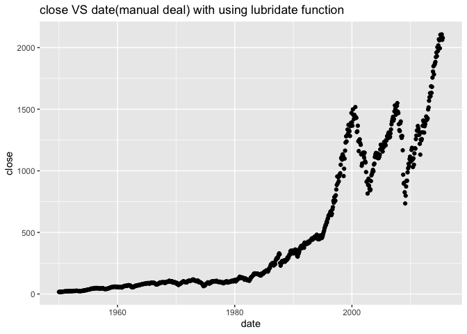

p8105\_hw2\_yl4925
================
Yiming Li
10/3/2021

## Problem 1

``` r
library(tidyverse)
```

    ## ── Attaching packages ─────────────────────────────────────── tidyverse 1.3.1 ──

    ## ✓ ggplot2 3.3.5     ✓ purrr   0.3.4
    ## ✓ tibble  3.1.4     ✓ dplyr   1.0.7
    ## ✓ tidyr   1.1.3     ✓ stringr 1.4.0
    ## ✓ readr   2.0.1     ✓ forcats 0.5.1

    ## ── Conflicts ────────────────────────────────────────── tidyverse_conflicts() ──
    ## x dplyr::filter() masks stats::filter()
    ## x dplyr::lag()    masks stats::lag()

``` r
trash_wheel_df = readxl::read_excel(
  "./data/Trash-Wheel-Collection-Totals-8-6-19.xlsx",
  sheet = "Mr. Trash Wheel",
  range = "A2:N408") %>% 
  janitor::clean_names() %>% 
  drop_na(dumpster) %>% 
  mutate(sports_balls = round(sports_balls))
```

``` r
pre2019 = readxl::read_excel(
  "./data/Trash-Wheel-Collection-Totals-8-6-19.xlsx",
  sheet = "2019 Precipitation",
  range = "A2:B14"
) %>% 
  janitor::clean_names() %>% 
  drop_na(total) %>% 
  mutate(year = 2019) %>% 
  relocate(year)

pre2018 = readxl::read_excel(
  "./data/Trash-Wheel-Collection-Totals-8-6-19.xlsx",
  sheet = "2018 Precipitation",
  range = "A2:B14"
) %>% 
  janitor::clean_names() %>% 
  drop_na(total) %>% 
  mutate(year = 2018) %>% 
  relocate(year)
```

``` r
##month.name is a vector, not function
bind_rows(pre2018, pre2019) %>% 
  mutate(month = month.name[month])
```

    ## # A tibble: 18 × 3
    ##     year month     total
    ##    <dbl> <chr>     <dbl>
    ##  1  2018 January    0.94
    ##  2  2018 February   4.8 
    ##  3  2018 March      2.69
    ##  4  2018 April      4.69
    ##  5  2018 May        9.27
    ##  6  2018 June       4.77
    ##  7  2018 July      10.2 
    ##  8  2018 August     6.45
    ##  9  2018 September 10.5 
    ## 10  2018 October    2.12
    ## 11  2018 November   7.82
    ## 12  2018 December   6.11
    ## 13  2019 January    3.1 
    ## 14  2019 February   3.64
    ## 15  2019 March      4.47
    ## 16  2019 April      1.46
    ## 17  2019 May        3.58
    ## 18  2019 June       0.42

``` r
sum(pull(pre2018, total))
```

    ## [1] 70.33

``` r
ball_2019 = filter(trash_wheel_df, year == 2019)
median(pull(ball_2019, sports_balls))
```

    ## [1] 8.5

## Problem 2

``` r
pols_month = read_csv("./data/fivethirtyeight_datasets/pols-month.csv") %>% 
  janitor::clean_names() %>% 
  separate(mon, into = c("year", "month", "day"), sep = "-") %>% 
  mutate(month = month.name[as.integer(month)]) %>% 
  rename(gop = prez_gop, dem = prez_dem) %>% 
  pivot_longer(
    c("gop", "dem"),
    names_to = "president",
    values_to = "logical") %>% 
  filter(logical != 0) %>% 
  select(-day, -logical) 
```

    ## Rows: 822 Columns: 9

    ## ── Column specification ────────────────────────────────────────────────────────
    ## Delimiter: ","
    ## dbl  (8): prez_gop, gov_gop, sen_gop, rep_gop, prez_dem, gov_dem, sen_dem, r...
    ## date (1): mon

    ## 
    ## ℹ Use `spec()` to retrieve the full column specification for this data.
    ## ℹ Specify the column types or set `show_col_types = FALSE` to quiet this message.

``` r
snp_raw = read_csv("./data/fivethirtyeight_datasets/snp.csv") %>% 
  janitor::clean_names() %>% 
  separate(date, into = c("month", "day", "year"), sep = "/") %>% 
  mutate(month = month.name[as.integer(month)]) %>%
  select(-"day") %>%
  arrange("year", "month")
```

    ## Rows: 787 Columns: 2

    ## ── Column specification ────────────────────────────────────────────────────────
    ## Delimiter: ","
    ## chr (1): date
    ## dbl (1): close

    ## 
    ## ℹ Use `spec()` to retrieve the full column specification for this data.
    ## ℹ Specify the column types or set `show_col_types = FALSE` to quiet this message.

``` r
snp_after_2000 = filter(snp_raw, year <= 15) %>% 
  mutate(year = as.character(as.numeric(year) + 2000))
snp_before_2000 = filter(snp_raw, year >= 50) %>% 
  mutate(year = as.character(as.numeric(year) + 1900))
snp = bind_rows(snp_after_2000, snp_before_2000) %>% 
  relocate(year, month) %>% 
  arrange(year, month)
```

``` r
unemployment = read_csv("./data/fivethirtyeight_datasets/unemployment.csv") %>% 
  pivot_longer(
    Jan:Dec, 
    names_to = "month",
    values_to = "unemployment"
  ) %>% 
  mutate(month = month.name[match(month,month.abb)])
```

    ## Rows: 68 Columns: 13

    ## ── Column specification ────────────────────────────────────────────────────────
    ## Delimiter: ","
    ## dbl (13): Year, Jan, Feb, Mar, Apr, May, Jun, Jul, Aug, Sep, Oct, Nov, Dec

    ## 
    ## ℹ Use `spec()` to retrieve the full column specification for this data.
    ## ℹ Specify the column types or set `show_col_types = FALSE` to quiet this message.

``` r
pols_snp = left_join(pols_month, snp) 
```

    ## Joining, by = c("year", "month")

``` r
pols_snp_unemployment = left_join(pols_snp, unemployment)
```

    ## Joining, by = "month"

## Problem 3

``` r
## 2012是bug的一年，名字和缩写都不对
pop_baby_name = read_csv("./data/Popular_Baby_Names.csv") %>% 
  janitor::clean_names() %>% 
  mutate(ethnicity = recode(ethnicity, "ASIAN AND PACI" = "ASIAN AND PACIFIC ISLANDER",
                            "BLACK NON HISP" = "BLACK NON HISPANIC",
                            "WHITE NON HISP" = "WHITE NON HISPANIC"),
         childs_first_name = str_to_sentence(childs_first_name),
         gender = str_to_sentence(gender),
         ethnicity = str_to_sentence(ethnicity))
```

    ## Rows: 19418 Columns: 6

    ## ── Column specification ────────────────────────────────────────────────────────
    ## Delimiter: ","
    ## chr (3): Gender, Ethnicity, Child's First Name
    ## dbl (3): Year of Birth, Count, Rank

    ## 
    ## ℹ Use `spec()` to retrieve the full column specification for this data.
    ## ℹ Specify the column types or set `show_col_types = FALSE` to quiet this message.

``` r
duplictaed_ones = pop_baby_name[duplicated(pop_baby_name[,1:4]),]
distinct_pop_name = pop_baby_name[!duplicated(pop_baby_name[,1:4]),]
```

``` r
Olivia_female_rank = filter(distinct_pop_name, gender == "Female" & childs_first_name == "Olivia") %>% 
  select(-gender, -childs_first_name, -count) %>% 
  pivot_wider(
    names_from = year_of_birth,
    values_from = rank
  )
```

``` r
most_popular_male_name = filter(distinct_pop_name, gender == "Male" & rank == 1) %>% 
  select(-gender, -rank, -count) %>% 
  pivot_wider(
    names_from = year_of_birth,
    values_from = childs_first_name
  )
```

``` r
male_nonhisp_2016 = filter(distinct_pop_name, gender == "Male", 
                           ethnicity == "White non hispanic", 
                           year_of_birth == 2016)
##library(ggrepel)
ggplot(male_nonhisp_2016, aes(x = rank, y = count)) + geom_point() 
```

<!-- -->

``` r
##+ geom_text_repel(aes(x = rank, y = count, label = childs_first_name))
```
